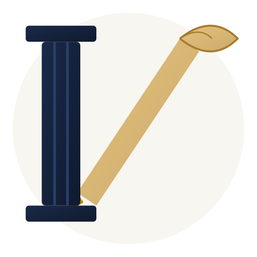

<div dir="rtl">

# LexOffece v2.0

**منصة إدارة مكاتب المحاماة** | Law Office Management Platform


</div>

<p align="center">
  
</p>

<div dir="rtl">

> تطبيق ديسكتوب متكامل لإدارة القضايا، الموكلين، الجلسات، الوثائق، المهام، والمصاريف مع مساعد ذكي بالذكاء الاصطناعي.
>
> Full-featured desktop app for managing clients, cases, hearings, documents, tasks, and expenses with an AI assistant.

---

## المميزات | Features

<div dir="rtl">

### الإدارة | Management
- **لوحة القيادة** — إحصائيات، جدول أعمال، مواعيد نهائية، ملخص مالي، رؤى AI
- **الموكلون (CRM)** — عرض جدول/بطاقات/segments، مساحة عمل بـ 8 تبويبات
- **القضايا** — عرض جدول/بطاقات/kanban، مساحة عمل بـ 10 تبويبات، سحب وإفلات
- **الجلسات** — قائمة قابلة للتصفية، مرتبطة بالتقويم
- **التقويم** — شهري/أسبوعي/يومي/جدول أحداث، كشف التعارضات
- **المهام** — قائمة/kanban/priorities/تحليلات، مهام فرعية، تعليقات، قوالب
- **الوثائق** — شبكة/جددول/مجلدات، رفع ملفات، OCR، تلخيص AI
- **المصاريف** — تتبع المدفوعات، ملخص الأتعاب

### الذكاء الاصطناعي | AI
- 7 أوضاع: محادثة، تلخيص، صياغة، تحليل، استراتيجية، مخاطر، تحضير جلسة
- تحليل الوثائق بالذكاء الاصطناعي
- رؤى ذكية في لوحة القيادة

### البحث | Search
- بحث عالمي (Ctrl+K)
- لوحة أوامر
- بحث متقدم

### الأمان | Security
- فصل السياق (contextIsolation)
- تشفير AES-256-GCM لمفاتيح API
- تشفير bcrypt لكلمات المرور (12 جولة)
- CSP headers + حماية XSS
- التحقق من قنوات IPC + rate limiting

</div>

---

## التقنيات | Tech Stack

| التقنية | Technology |
|---------|-----------|
| **التطبيق** | Electron 42 + Vanilla JS + CSS3 + HTML5 |
| **قاعدة البيانات** | SQLite عبر sql.js (ذاكرة + ملف) |
| **الذكاء الاصطناعي** | Groq API — llama-3.1-8b-instant |
| **البناء** | electron-builder NSIS (Windows) |
| **الاختبارات** | Mocha + Playwright |

---

## التشغيل السريع | Quick Start

```bash
# تثبيت التبعيات
npm install

# تشغيل التطبيق
npm start

# تشغيل الاختبارات (222 اختبار)
npm test

# بناء ملف التثبيت
npm run build
```

**متطلبات:**
- Node.js >= 18
- Windows 10/11

---

## هيكل المشروع | Project Structure

```
├── main.js                 # العملية الرئيسية (IPC, AI, Auth)
├── preload.js              # Context bridge + التحقق من IPC
├── renderer.js             # منسق التهيئة
├── db.js                   # طبقة SQLite (22 جدول)
├── index.html              # هيكل SPA (23 قسم)
├── style.css               # أنماط المكونات
├── modules/
│   ├── shared.js           # أدوات أساسية
│   ├── navigation.js       # تبديل الأقسام + lazy loading
│   ├── ipc-cache.js        # تخزين مؤقت للـ IPC
│   ├── clients/            # إدارة الموكلين
│   ├── cases/              # إدارة القضايا + kanban
│   ├── dashboard/          # لوحة القيادة
│   ├── calendar/           # التقويم (4 عروض)
│   ├── documents/          # إدارة الوثائق
│   ├── tasks/              # المهام + سير العمل
│   ├── hearings/           # الجلسات
│   ├── expenses/           # المصاريف
│   ├── search/             # البحث العالمي
│   ├── ai/                 # مساعد AI
│   ├── settings/           # الإعدادات
│   └── notifications/      # الإشعارات
├── db/                     # مساعدات DB модулярية
└── tests/                  # اختبارات الوحدة
```

---

## الأدوار | User Roles

| الدور | الصلاحيات |
|-------|----------|
| **مدير** | كل الصلاحيات |
| **محامي** | القضايا، الموكلون، الجلسات، الوثائق، AI |
| **مساعد** | المهام، التقويم، الوثائق (قراءة) |
| **محاسب** | المصاريف، التقارير المالية |
| **متتبع** | متابعة فقط (قراءة) |
| **زائر** | محدود جداً |

---

## الترخيص | License

هذا المشروع مرخص بـ [MIT License](LICENSE).

This project is licensed under the [MIT License](LICENSE).

---

## المساهمة | Contributing

مرحبا بالمساهمات! شوف [CONTRIBUTING.md](CONTRIBUTING.md) للتفاصيل.

Contributions are welcome! See [CONTRIBUTING.md](CONTRIBUTING.md) for details.

---

<p align="center">
  <b>صُنع بـ ❤️ للمكاتب القانونية المغربية</b><br>
  <sub>Built with ❤️ for Moroccan law offices</sub>
</p>
